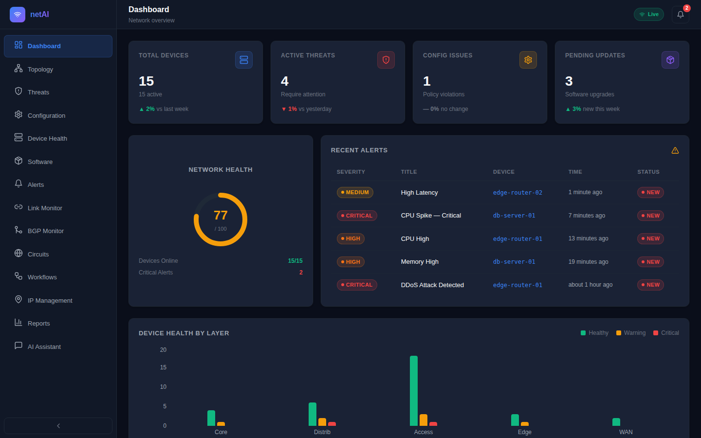
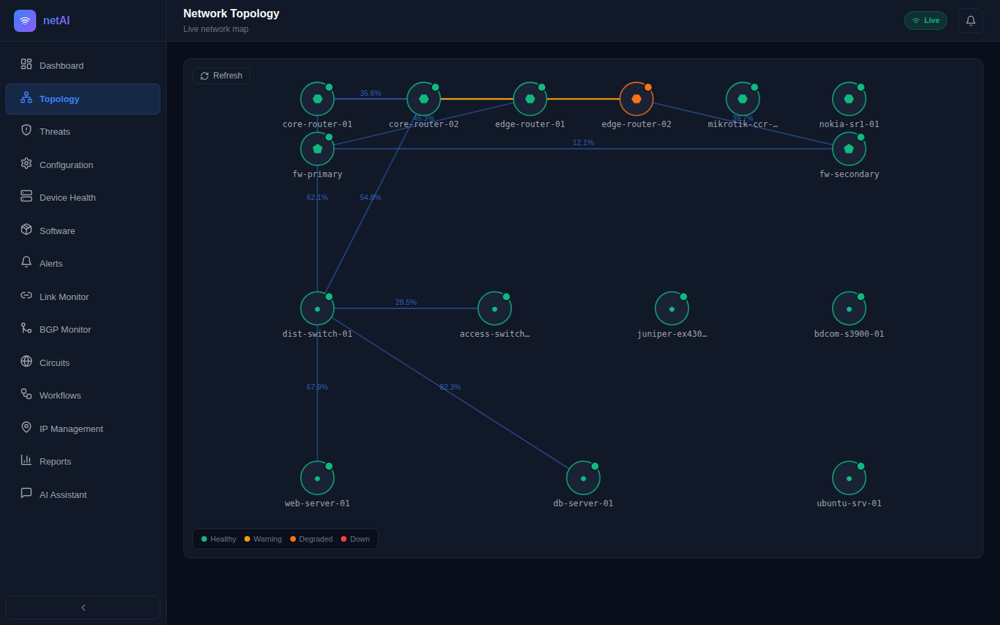
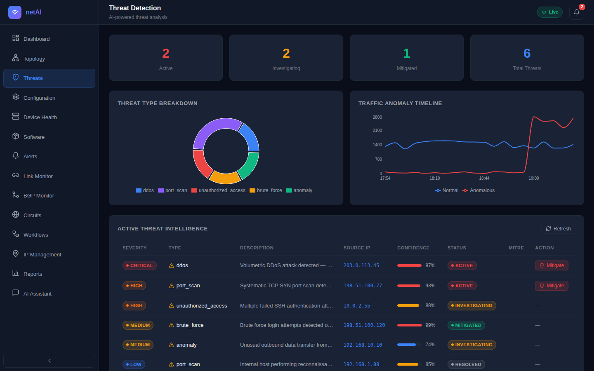
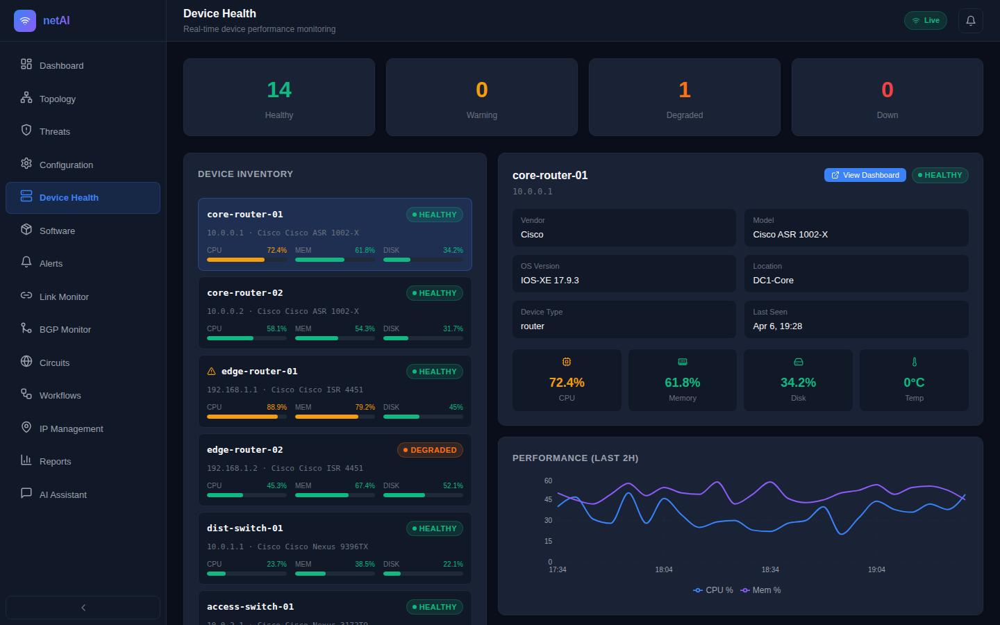
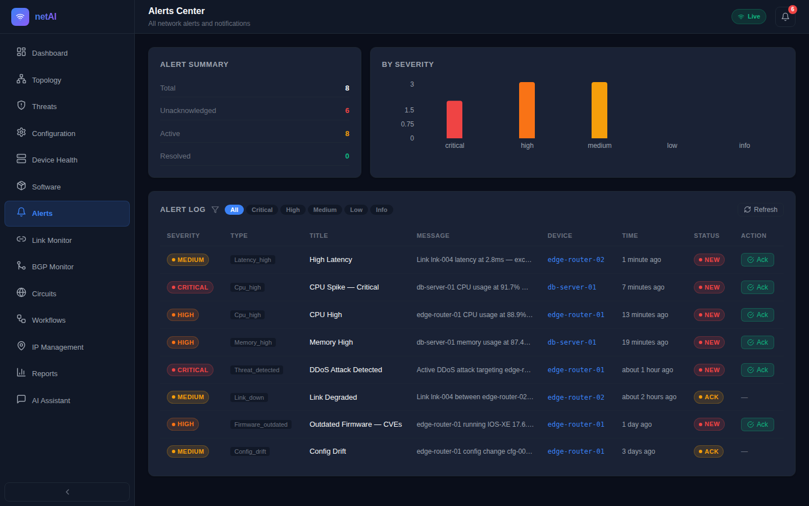
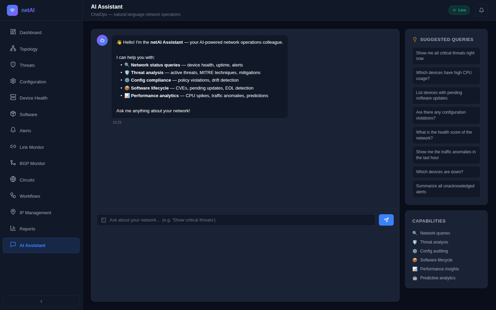
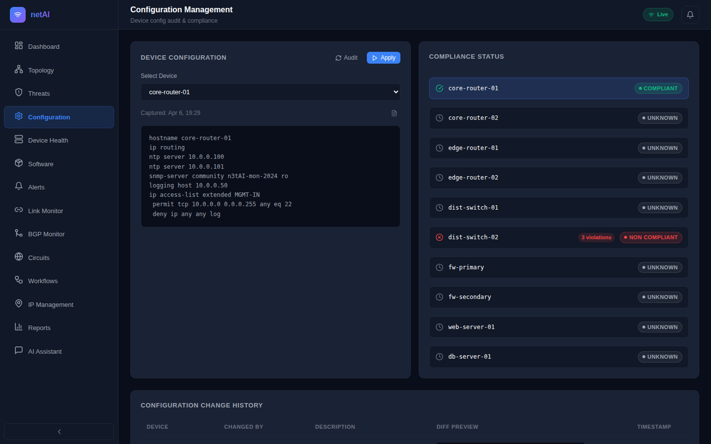
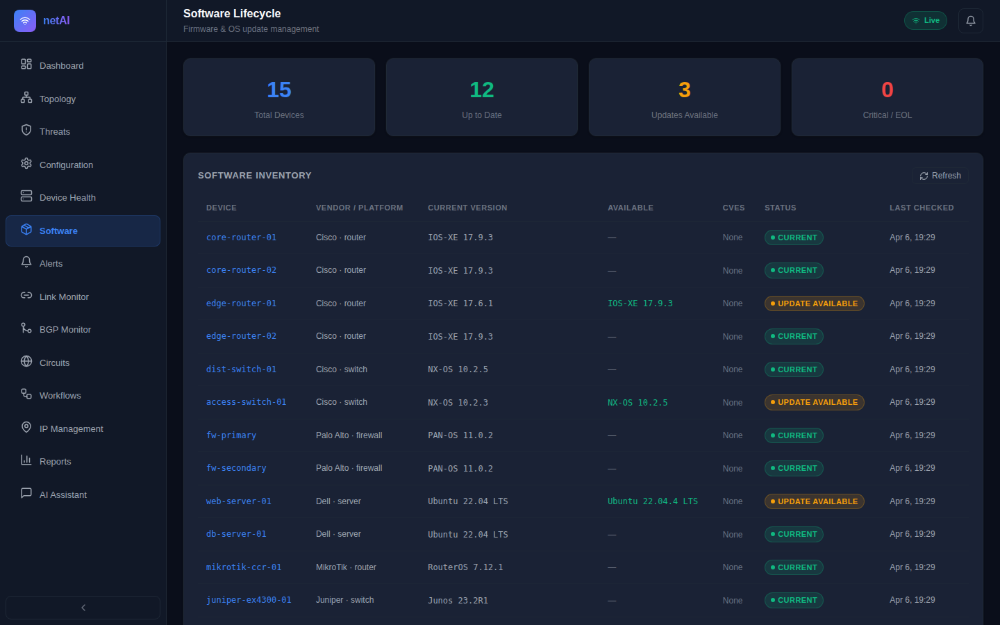
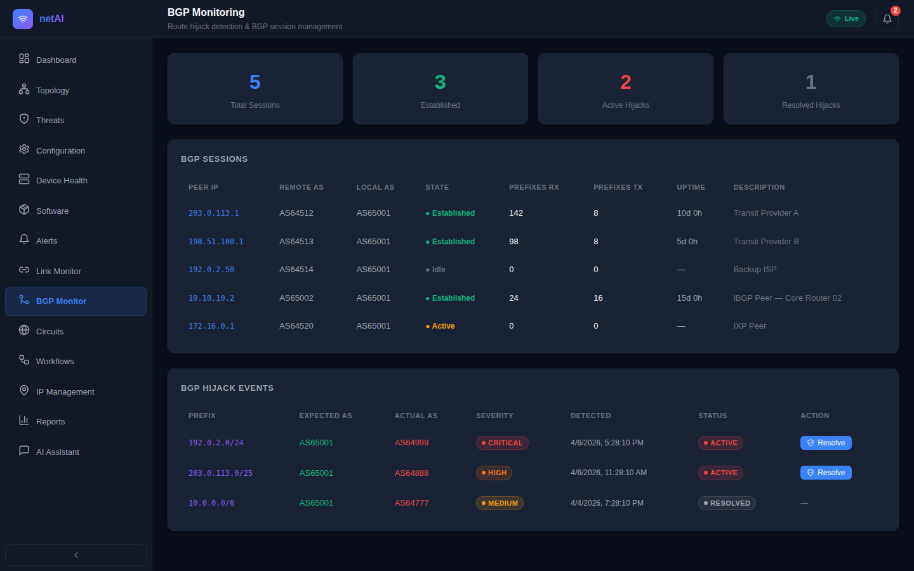
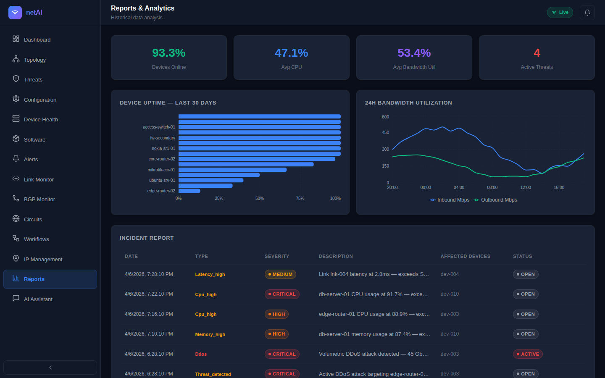

# netAI — Application Screenshots

> Generated: 2026-04-06 | All screenshots taken at 1440×900 resolution

---

## 01 — Dashboard

The main dashboard showing KPI cards, network health score, recent alerts, and device health by layer.

---

## 02 — Network Topology

Interactive SVG network map with colour-coded device nodes, link health, and click-to-inspect panel.

---

## 03 — Threat Detection

Active threat list with severity distribution pie chart, anomaly timeline, and mitigation actions.

---

## 04 — Device Health

Per-device CPU/memory/disk utilisation bars, performance charts, and failure prediction badges.

---

## 05 — Alerts Center

Unified alert center with severity filters, acknowledgment flow, and alert statistics.

---

## 06 — AI Assistant (ChatOps / NLP)

Natural language interface for network operations — query the network in plain English.

---

## 07 — Configuration Management

Per-device config viewer, compliance violation list, change history, and audit/apply actions.

---

## 08 — Software Lifecycle

Firmware inventory, CVE tracking, upgrade scheduling, and upgrade job status tracking.

---

## 09 — BGP Monitor

BGP session management with route hijack detection and one-click resolve workflow.

---

## 10 — Reports & Analytics

Historical bandwidth trends, per-device 30-day uptime charts, and incident rollup report.

---

*Screenshots are stored in `docs/screenshots/`. For the complete feature walkthrough, see [user-guide.md](user-guide.md).*
